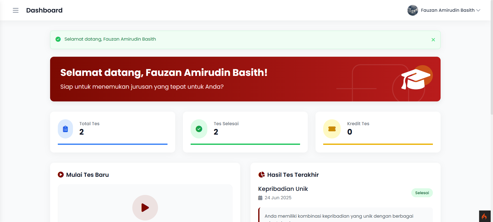
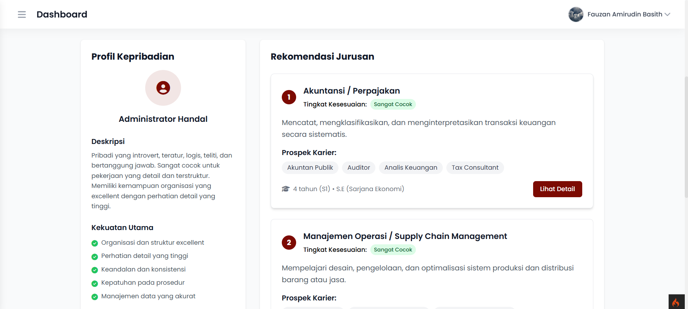
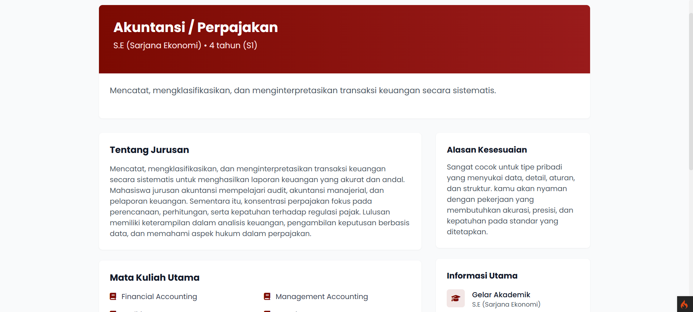

# 🧠 Analisis Minat - Personality Assessment System

<div align="center">
  
  <br>
  <p><i>Discover your personality type and find your perfect academic path</i></p>
</div>

## 📋 Table of Contents

- [Overview](#overview)
- [✨ Features](#-features)
- [🛠️ Installation](#️-installation)
- [🖥️ Usage](#️-usage)
- [📊 Database Structure](#-database-structure)
- [📱 Screenshots](#-screenshots)
- [🧰 Technology Stack](#-technology-stack)
- [⚙️ Project Structure](#️-project-structure)
- [🔧 Configuration](#-configuration)
- [🧪 Testing](#-testing)
- [🚀 Deployment](#-deployment)
- [👥 Contributing](#-contributing)
- [📝 License](#-license)
- [📞 Contact](#-contact)

## Overview

Analisis Minat is a comprehensive personality assessment system designed to help users discover their personality types and find academic majors that align with their strengths and preferences. The system provides personalized recommendations to guide educational and career choices based on scientifically validated personality assessment methods.

## ✨ Features

- 🔐 **User Authentication**: Secure registration and login system
- 📝 **Personality Assessment**: In-depth personality test with scientifically validated questions
- 📊 **Personalized Results**: Detailed analysis of personality types and traits
- 🎓 **Major Recommendations**: Academic majors that align with the user's personality type
- 📈 **User Dashboard**: Track test history and review previous results
- 🖨️ **PDF Reports**: Generate and download assessment results as PDF documents
- 👤 **User Profile Management**: Update personal information and profile pictures
- 💼 **Admin Panel**: Comprehensive management of questions, personality types, majors, and users
- 📱 **Responsive Design**: Fully functional across devices of various sizes

## 🛠️ Installation

### Prerequisites

- PHP 8.1 or higher
- Composer
- MySQL or MariaDB
- Web server (Apache/Nginx)
- Required PHP extensions: intl, mbstring, json, mysqlnd, libcurl

### Steps

1. Clone the repository

   ```bash
   git clone https://github.com/yourusername/Analisis-Minat-2.git
   cd Analisis-Minat-2
   ```

2. Install dependencies

   ```bash
   composer install
   ```

3. Configure environment

   ```bash
   cp env .env
   ```

   Edit `.env` file and configure your database settings:

   ```
   database.default.hostname = localhost
   database.default.database = analisis_minat
   database.default.username = your_username
   database.default.password = your_password
   ```

4. Run migrations and seeders

   ```bash
   php spark migrate
   php spark db:seed DatabaseSeeder
   ```

5. Start the development server
   ```bash
   php spark serve
   ```

## 🖥️ Usage

### User Flow

1. **Register/Login**: Create an account or login to access the assessment
2. **Take the Test**: Complete the personality assessment questionnaire
3. **View Results**: Receive detailed personality analysis and major recommendations
4. **Explore Majors**: Learn about recommended academic paths based on your results
5. **Generate PDF**: Download a comprehensive report of your assessment results

### Admin Flow

1. **Manage Questions**: Add, edit, or remove assessment questions
2. **Personality Types**: Configure personality types and their descriptions
3. **Major Management**: Add or update academic majors and their associations with personality types
4. **User Administration**: Manage user accounts and view activity logs

## 📊 Database Structure

The application uses a relational database with the following key tables:

- `users` - User account information
- `questions` - Assessment questions
- `personality_types` - Different personality types and their descriptions
- `majors` - Academic majors information
- `test_sessions` - Records of test attempts
- `test_answers` - User responses to questions
- `test_results` - Analysis results linking users to personality types
- `personality_major_mapping` - Relationships between personality types and recommended majors

## 📱 Screenshots

<div align="center">
  
  
  
  
</div>

## 🧰 Technology Stack

- **Framework**: CodeIgniter 4
- **Database**: MySQL/MariaDB
- **Frontend**: HTML5, CSS3, JavaScript, Bootstrap
- **PDF Generation**: TCPDF library
- **Authentication**: Custom implementation with session management

## ⚙️ Project Structure

```
Analisis-Minat-2/
├── app/                      # Application source code
│   ├── Controllers/          # Request handlers
│   ├── Models/               # Database models
│   ├── Views/                # UI templates
│   ├── Libraries/            # Custom libraries (PDF generator, etc.)
│   ├── Filters/              # Request filters (Auth, Admin)
│   └── Database/             # Migrations and seed data
├── public/                   # Publicly accessible files
│   ├── images/               # Image assets
│   ├── js/                   # JavaScript files
│   └── uploads/              # User uploaded content
└── writable/                 # Writable directory for logs, cache, etc.
```

## 🔧 Configuration

Key configuration files:

- `.env` - Environment variables (database, base URL, etc.)
- `app/Config/App.php` - Application settings
- `app/Config/Database.php` - Database connection settings
- `app/Config/Routes.php` - URL routing configuration

## 🧪 Testing

Run the test suite using PHPUnit:

```bash
composer test
```

## 🚀 Deployment

For production deployment:

1. Set environment to production in `.env`:

   ```
   CI_ENVIRONMENT = production
   ```

2. Configure proper server settings:

   - Point your web server to the `public` directory
   - Ensure `writable` directory permissions are set correctly
   - Configure proper database credentials

3. Optimize for production:
   ```bash
   composer install --optimize-autoloader --no-dev
   ```

## 👥 Contributing

1. Fork the repository
2. Create a feature branch: `git checkout -b feature-name`
3. Commit your changes: `git commit -m 'Add some feature'`
4. Push to the branch: `git push origin feature-name`
5. Submit a pull request

## 📞 Contact

For questions or support, please contact:

- Email: fauzan223360@gmail.com

---

<div align="center">
  <p>Built with ❤️ by Your Team</p>
</div>
